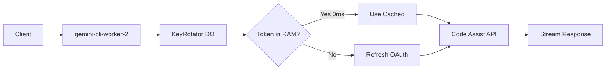

# Gemini OAuth Proxy - Implementation Plan

> **Status**: ✅ COMPLETE - Deployed and working
> **Live URL**: `https://gemini-cli-worker-2.vallangirakesh.workers.dev`
> **Last Updated**: 2026-01-13

High-performance Cloudflare Worker using **Durable Objects** for real-time OAuth rotation with 0ms token retrieval. Uses **Google Code Assist API** (`cloudcode-pa.googleapis.com`).

## Architecture



## Cloudflare Resources

| Resource | Binding | ID/Class |
|----------|---------|----------|
| Worker | - | `gemini-cli-worker-2` |
| Durable Object | `KEY_ROTATOR` | `KeyRotator` |
| KV Namespace | `GEMINI_CLI_KV` | `a107e98492e945bfabaaddd87234ac94` |
| Secrets | `GCP_SERVICE_ACCOUNT_1..25` | 25 OAuth credentials (JSON) |
| Secrets | `OAUTH_CLIENT_ID` | `YOUR_CLIENT_ID` |
| Secrets | `OAUTH_CLIENT_SECRET` | `YOUR_CLIENT_SECRET` |
| Secrets | Feature flags | `ENABLE_REAL_THINKING`, `STREAM_THINKING_AS_CONTENT` |

### Credential Format (`GCP_SERVICE_ACCOUNT_*`)

Each credential must be a JSON object with these fields:

```json
{
  "access_token": "ya29...",
  "refresh_token": "1//0g...",
  "scope": "openid https://www.googleapis.com/auth/cloud-platform ...",
  "token_type": "Bearer",
  "id_token": "eyJ...",
  "expiry_date": 1753379258242,
  "project_id": "gen-lang-client-XXXXXXXXX"
}
```

**Critical**: The `project_id` field is required for Code Assist API requests.

## Code Assist API Details

This worker uses Google's **Code Assist API**, NOT the standard Gemini API.

| Parameter | Value |
|-----------|-------|
| Endpoint | `https://cloudcode-pa.googleapis.com` |
| API Version | `v1internal` |
| Stream URL | `v1internal:streamGenerateContent?alt=sse` |
| Non-Stream URL | `v1internal:generateContent` |

### Request Format (Code Assist API)

```json
{
  "model": "gemini-3-flash-preview",
  "request": {
    "contents": [...],
    "generationConfig": {...}
  },
  "project": "gen-lang-client-XXXXXXXXX"
}
```

**Important differences from standard Gemini API:**
- Model ID has **NO `models/` prefix** (use `gemini-3-flash-preview`, not `models/gemini-3-flash-preview`)
- Request body wrapped in `request` field
- Requires `project` field with GCP project ID from credential
- Streaming requires `?alt=sse` query parameter

### Response Format (Code Assist API)

```json
{
  "response": {
    "candidates": [{
      "content": { "parts": [{ "text": "..." }] }
    }],
    "usageMetadata": { "promptTokenCount": 5, "candidatesTokenCount": 10 }
  }
}
```

**Note**: Response is nested inside `response` object, not flat like standard Gemini API.

## Implementation Details

### KeyRotator Durable Object (`src/KeyRotator.ts`)

| Feature | Implementation |
|---------|----------------|
| Credential Loading | Reads `GCP_SERVICE_ACCOUNT_1..25` from env on init |
| Token Cache | `Map<number, {token, expiry}>` in RAM (0ms retrieval) |
| Rate Limit Tracking | `Map<number, {proLimited, flashLimited, limitedUntil}>` |
| Smart Rotation | Skips rate-limited accounts, tracks Pro vs Flash separately |
| Auto-Retry | On 429/503, rotates to next account and retries |
| 401 Handling | Clears cached token and refreshes |
| OAuth Config | Reads `OAUTH_CLIENT_ID`/`OAUTH_CLIENT_SECRET` from env secrets |
| Diagnostics | `/diagnose` endpoint validates OAuth config |

### Worker Entry (`src/index.ts`)

| Endpoint | Method | Description |
|----------|--------|-------------|
| `/v1/chat/completions` | POST | OpenAI-compatible chat (defaults to `gemini-3-flash-preview`) |
| `/v1/models` | GET | List available models |
| `/v1/status` | GET | View DO state (accounts, tokens, rate limits) |
| `/v1/diagnose` | GET | Check OAuth configuration issues |

### Supported Models

- **`gemini-3-flash-preview`** (Default) - 20 req/day/account, 5 req/min/account
- `gemini-2.5-pro`
- `gemini-2.5-flash`
- `gemini-2.5-flash-lite`

## Troubleshooting

### Error: "Token refresh failed for X accounts"

**Cause**: OAuth token refresh is failing. Check:
1. `OAUTH_CLIENT_ID` and `OAUTH_CLIENT_SECRET` secrets are set correctly
2. Secrets match the OAuth client used to generate the refresh tokens
3. Run `/v1/diagnose` to verify configuration

**Fix**: Set the correct OAuth client credentials:
```bash
echo "YOUR_CLIENT_ID" | npx wrangler secret put OAUTH_CLIENT_ID
echo "YOUR_CLIENT_SECRET" | npx wrangler secret put OAUTH_CLIENT_SECRET
```

### Error: "Requested entity was not found" (404)

**Cause**: Model ID format or project ID issue.
- Model should NOT have `models/` prefix
- Credential must have valid `project_id` field

### Error: "Unknown name 'contents': Cannot find field" (400)

**Cause**: Request format doesn't match Code Assist API schema.
- Request body must be wrapped in `request` field
- Use format: `{ model, request: {...}, project }`

## Deploy Commands

```bash
# Install dependencies
npm install

# Local development
npm run dev

# Deploy to Cloudflare
npm run deploy

# Set OAuth secrets (required on first deploy)
echo "YOUR_CLIENT_ID" | npx wrangler secret put OAUTH_CLIENT_ID
echo "YOUR_CLIENT_SECRET" | npx wrangler secret put OAUTH_CLIENT_SECRET
```

## Test Commands

```bash
# List models
curl https://gemini-cli-worker-2.vallangirakesh.workers.dev/v1/models

# Non-streaming chat completion
curl -X POST https://gemini-cli-worker-2.vallangirakesh.workers.dev/v1/chat/completions \
  -H "Content-Type: application/json" \
  -d '{"model":"gemini-3-flash-preview","messages":[{"role":"user","content":"Hello!"}],"stream":false}'

# Streaming chat completion
curl -X POST https://gemini-cli-worker-2.vallangirakesh.workers.dev/v1/chat/completions \
  -H "Content-Type: application/json" \
  -d '{"model":"gemini-3-flash-preview","messages":[{"role":"user","content":"Hello!"}],"stream":true}'

# Check rotation status
curl https://gemini-cli-worker-2.vallangirakesh.workers.dev/v1/status

# Diagnose OAuth issues
curl https://gemini-cli-worker-2.vallangirakesh.workers.dev/v1/diagnose
```

## Build Stats

```
Bundle Size: ~107 KiB (gzip: ~25.5 KiB)
TypeScript Errors: 0
Dependencies: hono, @cloudflare/workers-types, wrangler
```

## Changelog

### 2026-01-13
- Fixed OAuth token refresh by setting correct `OAUTH_CLIENT_ID` and `OAUTH_CLIENT_SECRET` secrets
- Fixed Code Assist API request format (`{model, request: {...}, project}`)
- Fixed model ID to not use `models/` prefix
- Fixed response parsing for nested `response.candidates` format
- Added `?alt=sse` for streaming requests
- Added `/v1/diagnose` endpoint for troubleshooting
- Added enhanced error messages distinguishing rate limits from token refresh failures
- Added `project_id` support to OAuth credentials type
