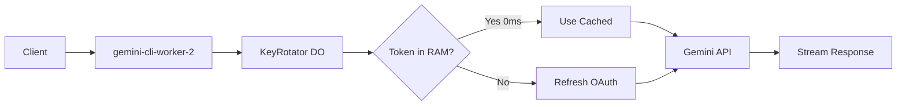

# Gemini OAuth Proxy - Implementation Plan

> **Status**: ✅ COMPLETE - Ready for deployment
> **Live URL**: `https://gemini-cli-worker-2.vallangirakesh.workers.dev`

High-performance Cloudflare Worker using **Durable Objects** for real-time OAuth rotation with 0ms token retrieval.

## Architecture



## Cloudflare Resources

| Resource | Binding | ID/Class |
|----------|---------|----------|
| Worker | - | `gemini-cli-worker-2` |
| Durable Object | `KEY_ROTATOR` | `KeyRotator` |
| KV Namespace | `GEMINI_CLI_KV` | `a107e98492e945bfabaaddd87234ac94` |
| Secrets | `GCP_SERVICE_ACCOUNT_1..25` | 25 OAuth credentials |
| Secrets | `OAUTH_CLIENT_ID`, `OAUTH_CLIENT_SECRET` | OAuth Client Credentials (Env) |
| Secrets | Feature flags | `ENABLE_REAL_THINKING`, `STREAM_THINKING_AS_CONTENT` |

## Implementation Details

### KeyRotator Durable Object (`src/KeyRotator.ts`)

| Feature | Implementation |
|---------|----------------|
| Credential Loading | Reads `GCP_SERVICE_ACCOUNT_1..25` from env on init |
| Token Cache | `Map<number, {token, expiry}>` in RAM (0ms retrieval) |
| Rate Limit Tracking | `Map<number, {proLimited, flashLimited, limitedUntil}>` |
| Smart Rotation | Skips rate-limited accounts, tracks Pro vs Flash separately |
| Auto-Retry | On 429/503, rotates to next account and retries |
| 401 Handling | Clears cached token and refreshes |
| Secure Config | Reads `OAUTH_CLIENT_ID` from environment secrets |

### Worker Entry (`src/index.ts`)

| Endpoint | Method | Description |
|----------|--------|-------------|
| `/v1/chat/completions` | POST | OpenAI-compatible chat (defaults to `gemini-3-flash-preview`) |
| `/v1/models` | GET | List available models |
| `/v1/status` | GET | View DO state (accounts, tokens, rate limits) |

### Supported Models

- **`gemini-3-flash-preview`** (Default)
  - Limits: 20 req/day/account, 5 req/min/account, 250K tokens/min
- `gemini-2.5-pro`
- `gemini-2.5-flash`
- `gemini-2.5-flash-lite`

## Build Stats

```
Bundle Size: 103.76 KiB (gzip: 24.79 KiB)
TypeScript Errors: 0
Dependencies: hono, @cloudflare/workers-types, wrangler
```

## Deploy Commands

```bash
# Install dependencies
npm install

# Local development
npm run dev

# Deploy to Cloudflare
npm run deploy
```

## Test Commands

```bash
# List models
curl https://gemini-cli-worker-2.vallangirakesh.workers.dev/v1/models

# Chat completion
curl -X POST https://gemini-cli-worker-2.vallangirakesh.workers.dev/v1/chat/completions \
  -H "Content-Type: application/json" \
  -d '{"model":"gemini-3-flash-preview","messages":[{"role":"user","content":"Hello!"}]}'

# Check rotation status
curl https://gemini-cli-worker-2.vallangirakesh.workers.dev/v1/status
```
